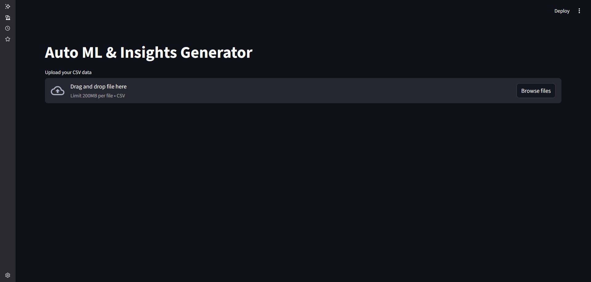
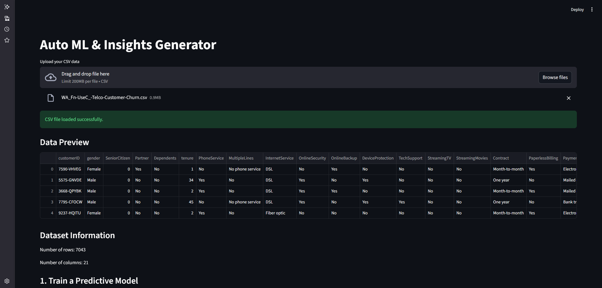
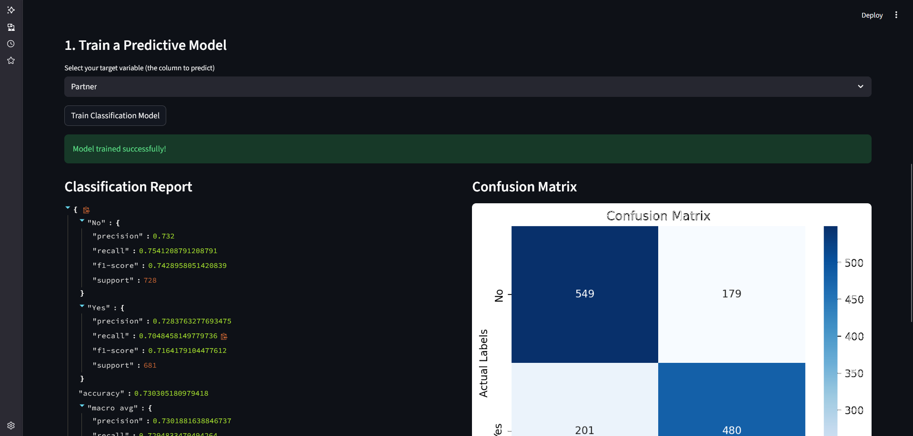
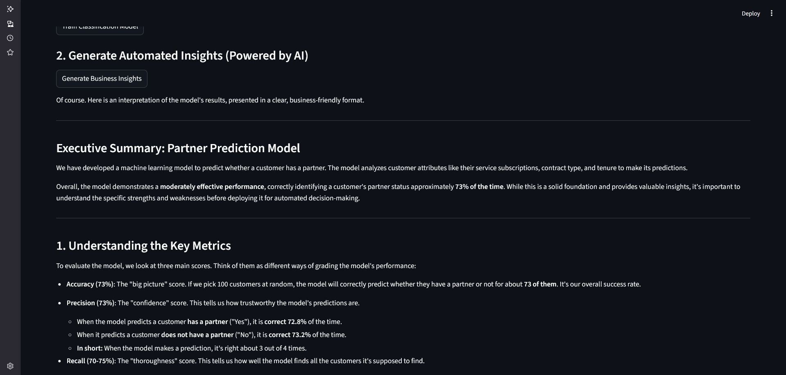

# Auto ML Insights Generator (Predictive Modeling & Generative AI)

### An interactive web application that automates the machine learning workflow, from training a model with Scikit-learn to generating business insights with Google's Gemini 2.5 Pro.

    

## 🚀 Live Application

[](https://auto-ml-insights-generator-xnxufbdynrpaymz9t2dmgu.streamlit.app/)

**You can test the live version of this application here:** [**auto-ml-insights-generator.streamlit.app**](https://auto-ml-insights-generator-xnxufbdynrpaymz9t2dmgu.streamlit.app/)

## ✨ Overview

This project showcases a powerful, end-to-end application that bridges the gap between raw data and actionable business intelligence. The goal is to empower users—even those without a technical background—to perform a complete machine learning workflow: upload a dataset, automatically train a predictive model, and receive a clear, human-readable interpretation of the results generated by AI.

The core of this project is the synergy between classical machine learning (**Scikit-learn**) for predictive power and **Generative AI** (**Google's Gemini 2.5 Pro model**) for insightful interpretation.

## 💡 Key Features

*   **Interactive Web Application:** Development of a user-friendly and responsive interface using **Streamlit**.
*   **Secure API Key Management:** Industry-standard use of `.env` files and `python-dotenv` for local development.
*   **Automated Machine Learning:** A pipeline that automatically prepares data, trains a `RandomForestClassifier` model, and evaluates its performance using **Scikit-learn**.
*   **Generative AI Integration:** Practical application of a large language model (**Google Gemini 2.5 Pro**) to translate complex model metrics into clear, non-technical language and generate strategic business recommendations.
*   **End-to-End Workflow:** Demonstrates the complete process from raw CSV data upload to the final delivery of AI-powered insights, showcasing skills in building a full-fledged data product.

## 🛠️ How to Run

1.  **Clone the repository:**
    ```bash
    git clone https://github.com/takzen/auto-ml-insights-generator.git
    cd auto-ml-insights-generator
    ```

2.  **Create a virtual environment and install dependencies:**
    *   This project requires Python 3.9+. Create a virtual environment using `uv`:
        ```bash
        uv venv
        source .venv/bin/activate # or .venv\Scripts\activate on Windows
        ```
    *   Install the required packages using the single command:
        ```bash
        uv pip install streamlit pandas python-dotenv scikit-learn matplotlib seaborn google-generativeai
        ```

3.  **Set up your Google AI API Key:**
    *   Create a file named `.env` in the root of the project.
    *   Add your Google AI API key to this file:
        ```
        GOOGLE_API_KEY="YOUR_API_KEY_HERE"
        ```
    *   The `.gitignore` file is configured to prevent this file from being committed.

4.  **Run the Streamlit application:**
    ```bash
    streamlit run app.py
    ```

5.  Open your browser, upload a CSV file, select a target variable, and start generating insights!

## 🖼️ Showcase

This showcase walks through the user's journey from a blank canvas to actionable, AI-driven insights.

| 1. Initial State                                       | 2. Data Uploaded & Previewed                               |
| :----------------------------------------------------- | :--------------------------------------------------------- |
|          |               |
| *The user is greeted with a clean interface, ready to upload their dataset.* | *After uploading a CSV file, the app displays a data preview and summary statistics.* |

| 3. Model Trained & Evaluated                           | 4. AI-Powered Insights Generated                             |
| :----------------------------------------------------- | :--------------------------------------------------------- |
|           |  |
| *The user trains a model and instantly sees its performance via a classification report and confusion matrix.* | *Finally, Gemini generates a human-readable report, explaining the model's results and offering business advice.* |